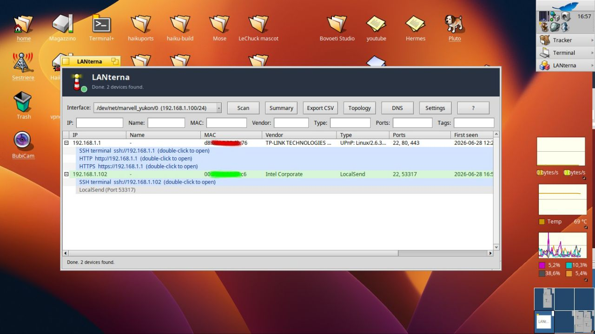

# LANterna

Native LAN scanner for Haiku: a self-contained BeAPI app that walks the
local subnet, probes TCP services, and enriches every host with vendor
(OUI), reverse DNS, mDNS / DNS-SD, NetBIOS, SNMP and SSDP / UPnP signals.
Results are stored on BFS attributes so they survive across runs; a
periodic auto-scan keeps the inventory live, and BNotifications fire when
a new device joins or a known one drops off the LAN.

<p align="center">
  <br/>
  <em>Main window — slate HeaderView with state dot on top, device table
  with per-column live filters, coloured action rows for SSH / HTTP /
  SMB, and the live scan status in the bottom bar.</em>
</p>

If LANterna saves you time, consider supporting development: [](https://buymeacoffee.com/atomozero)


## Features

* **End-to-end LAN discovery** — sweeps the selected interface's
  subnet with parallel non-blocking TCP connects, then runs a
  pluggable `Enricher` pipeline on every responder to flesh out the
  row (MAC, vendor, hostname, type, banners).
* **Pluggable enricher pipeline** — `ArpMacEnricher` (MAC from the
  kernel ARP cache), `OuiVendorEnricher` (vendor from the IEEE OUI
  table), `ReverseDnsEnricher` (unicast PTR), `MdnsEnricher` (mDNS /
  DNS-SD multicast discovery), `NetBiosEnricher` (UDP 137 NBSTAT),
  `SnmpEnricher` (SNMPv1 sysDescr / sysName), `SsdpEnricher` (UPnP
  M-SEARCH for smart-TVs, Sonos, NAS, IGD routers), and
  `TypeInferenceEnricher` (device class inferred from the open-port
  fingerprint). Multicast enrichers query once per scan and cache by
  IP; unicast ones contact every host with a tight 250-300 ms
  timeout.
* **Haiku-native UI** — `BColumnListView` driven device table with
  per-column live filtering, a coloured port-action child row under
  every host (click a `[ssh]` / `[http]` / `[smb]` cell to open it
  through Tracker), and a context menu for ping, traceroute, history
  and Wake-on-LAN.
* **Sotoportego-family identity** — slate `HeaderView` banner with
  the `Beacon.hvif` brand tile and a state-coloured dot: grey
  *Ready*, amber *Scanning %d%%*, green *Done. N devices found.*,
  red *No interface* or *Cannot start scan*. The subtitle mirrors
  what's happening in real time. Easter egg: seven taps on the brand
  tile in three seconds opens the About box.
* **BFS-attribute persistence** — every device (alias, notes, tags,
  favourite / blacklist flags, first/last seen) is written as
  `LANTERNA:*` attributes on a per-host file under
  `~/config/settings/LANterna/devices/`, so a re-scan rebuilds the
  inventory in its previous state and `Tracker` queries can find
  hosts by tag or vendor.
* **Pivot / Summary window** — group the current scan by vendor,
  type or open-port set; counts and percentages roll up in a
  `BColumnListView` you can keep open alongside the main one.
* **Interactive topology** — `TopologyView` draws a force-laid
  graph of every host coloured by inferred role (gateway, web, ssh,
  smb, printer, default). Nodes are draggable and can be pinned;
  the gateway always starts at the centre.
* **Per-host history** — each device gets a `HistoryWindow` with a
  green / red timeline of online intervals, a 7-day x 24-hour
  heatmap of uptime minutes per hour, and a timestamped event log.
  Backed by an append-only event file under
  `~/config/settings/LANterna/history/`.
* **Continuous ping** — `PingWindow` runs a TCP-connect latency
  probe against `host:port` in a worker thread, drawing the sample
  history as a live graph with Last / Avg / Min / Max / Loss / Count
  stats below.
* **Built-in DNS lookup & traceroute** — `DnsLookupWindow` resolves
  any A / AAAA / MX / TXT / SRV / NS / PTR / SOA / CNAME record
  against a configurable resolver; `TracerouteWindow` shells out to
  the system `traceroute` and streams hops into a column view.
* **Wireless context** — `WifiInfo` decorates every interface entry
  in the picker with SSID and signal % when the underlying NIC is
  wireless, so you know which AP you're scanning from.
* **Periodic auto-scan + offline detection** — a `BMessageRunner`
  re-runs the scan at the user-set cadence; hosts that were online
  before and didn't answer this round fire a *X is offline*
  `BNotification`, and new hosts fire a *new device* one. The
  *NetworkReplicant* shows the live online-count next to the
  Deskbar clock.
* **Wake-on-LAN** — fire a magic packet at any known MAC straight
  from the row context menu.
* **Multilingual UI** — every visible string goes through the
  `Tr(StringId)` table in `src/ui/Locale.h`; Italian, English,
  Spanish, German and Japanese ship today. The active language is
  auto-detected from the Haiku locale at first launch and is
  switchable from the Settings window.
* **CSV export** — dump the current filtered view to a CSV that
  drops cleanly into a spreadsheet for record-keeping or asset
  audits.


## Requirements

* **Haiku R1/beta5 or newer.**
* The standard system libraries shipped with Haiku: `libbe`,
  `libnetwork`, `libbsd`, `libcolumnlistview`, `libshared`,
  `libtracker`, `libnetapi`, `libssl`, `libcrypto`. No HaikuDepot
  packages needed beyond the base install.
* For an up-to-date vendor lookup, drop the latest IEEE OUI file at
  `~/config/settings/LANterna/oui.txt` or next to the binary as
  `oui.txt`. A trimmed sample (`data/oui-sample.txt`) ships with
  the source for the CLI demo.


## Build

The project carries two makefiles. The core scanner is plain POSIX
and builds anywhere; the BeAPI UI builds on Haiku only.

```
make                            # core + lanterna-cli, portable POSIX
make -f Makefile.haiku          # core + UI + Haiku resources, on Haiku
make -f Makefile.haiku clean    # remove all build artifacts
```

The Haiku target also compiles `LANterna.rdef` into `LANterna.rsrc`
(via `rc`), injects the resources into the binary (`xres`) and
registers the MIME type (`mimeset`), so Tracker shows the proper
`Beacon.hvif` icon — without those three steps the binary boots
with the generic Haiku icon even though the rdef is present.


## Run

### GUI

```
./LANterna
```

From the main window:

1. Pick an interface from the dropdown — wireless ones show the
   SSID and signal strength next to the IP/netmask. *All interfaces*
   is offered when more than one is present.
2. Click **Scan**. The header dot turns amber and the subtitle
   tracks the progress percentage; the device table fills in as
   responders come back. Each host shows IP, hostname, MAC, vendor,
   inferred type, open-port summary, first/last seen and tags.
3. Open the per-column filter row to live-search by any field.
4. Double-click a host to open its details window; double-click a
   coloured `[ssh]` / `[http]` / `[smb]` child row to launch the
   corresponding URL through Tracker.
5. Right-click any host for the context menu: Ping, Traceroute,
   History, Wake-on-LAN, Favourite / Blacklist toggle, Edit alias
   and notes, Copy IP / MAC.
6. **Summary** opens the pivot window; **Topology** draws the
   network graph; **DNS** opens the standalone resolver; **Export**
   writes the current filtered table to a CSV.

The **Settings** button covers language, the scanned port list,
connect timeout, max in-flight probes, auto-scan interval and the
banner-grab toggle.

### CLI

```
./lanterna-cli --list-interfaces
./lanterna-cli --oui data/oui-sample.txt
```

The CLI exercises the same core scanner without the UI, useful for
smoke-testing the discovery logic on POSIX hosts during
development.


## Layout

```
src/net/       Low-level networking primitives — Subnet, PortProbe,
               Resolver, ArpCache, WakeOnLan, BannerGrabber,
               TlsCertGrabber, DnsLookup.
src/model/     DeviceStore (in-memory), DevicePersistence (BFS
               attributes) and DeviceHistory (append-only event log
               for the per-host History window).
src/enrich/    The Enricher pipeline — OuiDatabase + the seven
               concrete enrichers (ARP MAC, OUI vendor, reverse
               DNS, mDNS, NetBIOS, SNMP, SSDP, type inference).
src/scan/      Scanner — orchestrates a single scan: enumerate
               targets, parallel probe, run enrichers, emit
               BMessages.
src/cli/       lanterna-cli — POSIX test driver for the core.
src/ui/        LANterna — the native GUI. Main window stack:
               HeaderView (slate banner + state dot + Beacon
               tile), MainWindow, DeviceDetailsWindow, PivotWindow,
               TopologyView, HistoryWindow, PingWindow,
               TracerouteWindow, DnsLookupWindow, SettingsWindow,
               NetworkReplicant (Deskbar live count), ScanRunner
               (worker-thread driver), WifiInfo (SSID / signal
               sidecar), Locale.h (5-language string table).
data/          oui-sample.txt — trimmed IEEE OUI file for the CLI
               demo; replace with the real one at
               ~/config/settings/LANterna/oui.txt for full vendor
               coverage.
docs/          Design notes for the L0 discovery layer and the
               on-Haiku verification checklist.
```

| Binary          | MIME signature                          |
| --------------- | --------------------------------------- |
| `LANterna`      | `application/x-vnd.atomozero-LANterna`  |
| `lanterna-cli`  | POSIX binary, no Haiku MIME             |


## Architecture notes

* **The Scanner is the single source of truth during a scan.** The
  UI dispatches `kMsgScanStart` and otherwise just renders what the
  worker thread broadcasts: `kMsgDeviceFound`, `kMsgScanProgress`,
  `kMsgScanDone`. State changes — the `HeaderView` dot included —
  are reactions to those messages on the window's looper thread,
  never direct mutations from the worker.
* **Persistence is per-host.** Each device lives in its own file
  under `~/config/settings/LANterna/devices/` with all user
  metadata stored as `LANTERNA:*` BFS attributes. That lets
  Tracker queries find hosts by tag, vendor or favourite flag
  without LANterna being open, and lets the next scan rebuild
  the inventory from the filesystem rather than a database.
* **Multicast enrichers run once per scan.** `MdnsEnricher` and
  `SsdpEnricher` fire a single discovery burst at the start of
  the scan and populate `ip -> data` caches; the per-host
  `Enrich()` then just looks up the cache. Unicast enrichers
  (`NetBiosEnricher`, `SnmpEnricher`) contact each host directly
  with tight timeouts so they don't stall the scan tail.
* **Locale is a compile-time table.** `src/ui/Locale.h` is a
  flat `[StringId][Language] -> const char*` array. Switching
  language at runtime walks the table; there's no `.catkey`
  pipeline and no external dependency.
* **The `HeaderView` is shared identity with Sotoportego.** Same
  slate background, same dot palette, same HVIF caching strategy.
  Only the brand tile (`Beacon.hvif`) and the state enum
  (`kHeaderIdle / Progress / Done / Error` mapped to scan
  phases) differ.


## Roadmap

* IPv6 sweep mode for link-local prefixes (today the scanner
  enumerates IPv4 subnets only; IPv6 traceroute and ping already
  work per-host).
* Optional raw ICMP sweep behind a Settings flag for users with
  the privilege to open raw sockets — useful for hosts that
  silently drop the TCP probe.
* Service-version probes (HTTP server header, SSH banner parse,
  TLS cert grab is wired but disabled by default).
* `MetricPill`-style freshness badge in the device details window
  (Online / Recent / Stale / Never), borrowed from Sotoportego's
  visual vocabulary.
* Export to JSON in addition to CSV.


## Be careful

> **Developer's Note**: This software may contain traces of peanuts
> and LLM. It has been developed with passion for the Haiku
> platform.


## Support

If you find this project useful, you can buy me a coffee: [](https://buymeacoffee.com/atomozero)
